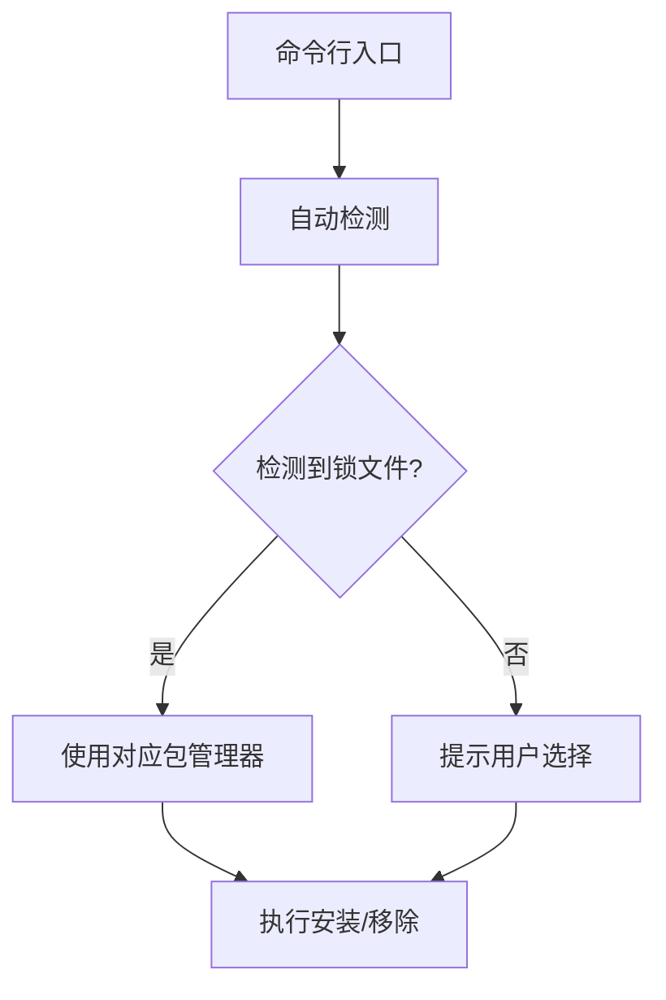

# bun-ni

<p align="center">
  <br>
  <em>智能包管理工具 - 专为 Bun 生态打造</em>
</p>

## 灵感来源

本项目受 [@antfu](https://github.com/antfu) 的 [ni](https://github.com/antfu/ni) 项目启发，专为 Bun 运行时环境重新设计，保留了自动检测包管理器的核心理念，同时针对 Bun 进行了深度优化。

## 特性亮点

✨ **Bun 原生支持** - 直接使用 Bun 运行时，无需 Node.js 环境  
🔍 **智能检测** - 自动识别项目使用的包管理器（npm/yarn/pnpm/bun）  
⚡ **闪电执行** - 利用 Bun 的超高性能执行包管理操作  
🎨 **友好交互** - 彩色终端输出和确认提示  
📦 **零配置** - 开箱即用，无需额外配置  

## 安装使用

```bash
# 通过 Bun 安装
bun add -g bun-ni
```

## 核心命令

| 命令 | 功能描述 | 示例 |
|------|----------|------|
| `bni` | 安装依赖 | `bni lodash` |
| `bnr` | 移除依赖 | `bnr lodash` |
| `bn`  | 显示帮助 | `bn` |

## 进阶用法

```bash
# 安装开发依赖
bni typescript -D

# 同时安装多个包
bni lodash @types/node

# 移除多个包
bnr eslint prettier
```

## 技术架构



## 贡献指南

欢迎提交 PR 或 Issue！开发流程如下：

1. 克隆仓库
```bash
git clone https://github.com/Lpuena/bun-ni.git
```
2. 安装依赖
```bash
bun install
```
3. 开发测试
```bash
bun test
```

## 许可证

MIT © [Lpuena]

---

<p align="center">
让 JavaScript 包管理更简单愉快！ 🎉
</p>